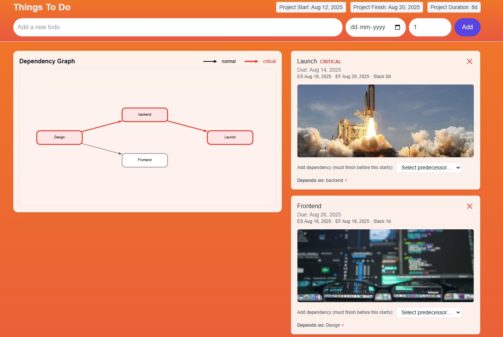
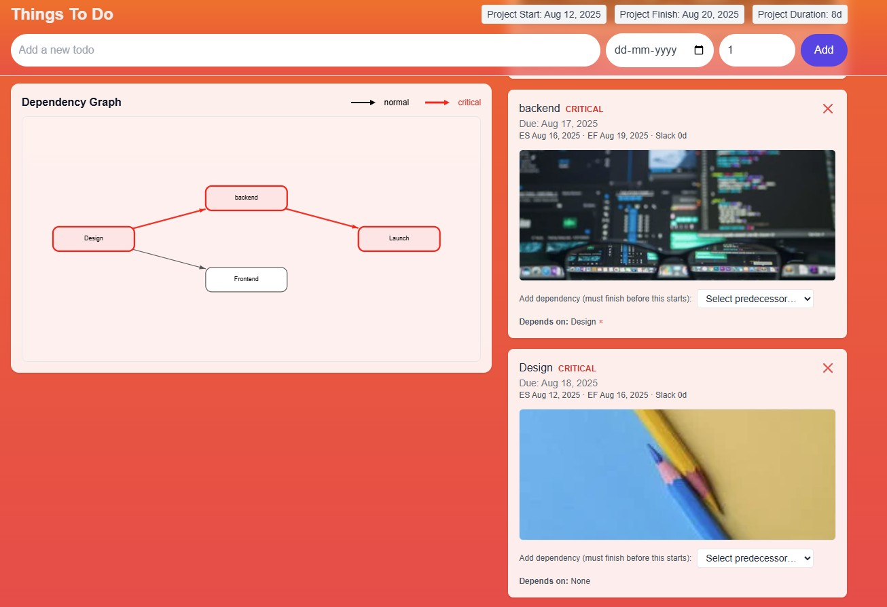

## Project Overview

## Part 1: Due Dates

-Users can set a due date at creation.

-The task list shows the date.

-If past due, it’s clearly highlighted in red.

### What the user sees

-When creating a task, there’s a date picker next to the title field.

-In the list, each task shows “Due: …”. If the due date is in the past, it appears red & bold.

### Key implementation

-DB: Todo.dueDate is DateTime? in Prisma.

-Create: In page.tsx, we read the date input and send it in POST /api/todos.
  
        We convert YYYY-MM-DD → ISO before sending.

-API: In app/api/todos/route.ts, we accept dueDate and store new Date(dueDate) (or null).

-Display: A small util isOverdue(iso) compares new Date(iso) with now and toggles red styling. We format with Intl.DateTimeFormat.

## Part 2: Image Generation

-We fetch a relevant image at create time.

-We show it in the todo.

-There’s a clear loading indication, and failures don’t break task creation.

### What the user sees

-When a todo is created, a relevant image appears inside the card.

-While the image is loading, a “Loading image…” pulse overlay is shown.

-If no image, a neutral placeholder says “No image found”.

### Key implementation

-API call: In POST /api/todos, we query the Pexels API using the task title:

        -GET https://api.pexels.com/v1/search?query=<title>&per_page=1
        -Header: Authorization: <PEXELS_API_KEY>
        -We pick photo.src.medium/large as imageUrl.
        -If Pexels fails, we still create the task (image optional).

-Client loading state:

        -imgLoading: Record<number, boolean> keyed by task id.
        -We set it true for items with imageUrl until onLoad/onError fires.

-Lazy load:  for perf.

## Part 3: Task Dependencies

### What the user sees

-Each task card has a “Add dependency” dropdown to select predecessors (“must finish before this starts”).

-A “Depends on:” line lists current predecessors with a ✕ to remove.

-The Dependency Graph shows tasks as nodes and arrows from predecessor → successor:

        -Critical path nodes/edges are red; others are dark gray/black.
        -A legend clarifies normal (black) vs critical (red).

-Each card shows ES / EF / Slack and a CRITICAL chip when slack = 0.

## Server logic (CPM + cycle prevention)

### Routes

-POST /api/dependencies — add an edge; rejects cycles.

-DELETE /api/dependencies — remove an edge.

-GET /api/plan — returns:
    
        -tasks with ES/EF/LS/LF/slack/isCritical,
        -edges,
        -project start/finish and duration.

### Scheduling utils (/lib/scheduling.ts)

-topoSort: Kahn’s algorithm → throws if cycle.

-wouldCreateCycle(nodes, edges, candidate): tests a new edge.

-cpm(nodes, edges): Critical Path Method

        -Forward pass → ES/EF
        -Backward pass → LS/LF
        -Slack = LS − ES, isCritical = slack === 0

-We compute in days, then map to real dates using the earliest createdAt as project start (can be swapped to a fixed date if you prefer).

## UI (graph + editor + layout)

-Duration field in the Add form (durationDays) so CPM has real durations.

-Task cards show ES/EF/Slack and CRITICAL when applicable.

-Dropdown adds dependencies; server blocks circular links gracefully with an error.

-Graph: Custom SVG renderer
    
        -Automatic layering (sources → sinks).
        -Rotated arrowheads that end outside node borders.
        -Critical path colored red (nodes & edges); normal edges black/gray.
        -Legend uses black (normal) and red (critical).

-Modern layout
    
        -Sticky graph panel on the left, task list on the right (responsive).
        -Reliable sticky offset using measured header height (no initial jump).
        -Removed accidental white-on-white and invisible dropdown text.

## Overall

-Multiple dependencies: via Dependency rows (many predecessors).

-Prevent circular dependencies: wouldCreateCycle + topoSort on each POST.

-Show the critical path: CPM marks zero-slack tasks and the graph highlights them.

-Earliest possible start: ES computed from predecessors and mapped to dates.

-Visualize the graph: SVG DAG with arrows, colors, legend.

## Quick demo scenario (to verify)

-Create tasks: Design (4d), Backend (3d), Frontend (2d), Launch (1d).

-Add deps:

        -Backend ← Design
        -Frontend ← Design
        -Launch ← Backend

-You’ll see:

        -Critical path: Design → Backend → Launch (8d).
        -Frontend branch has Slack 1d.   
        -Graph shows two arrows into Launch; critical chain in red.

-Example Output:

